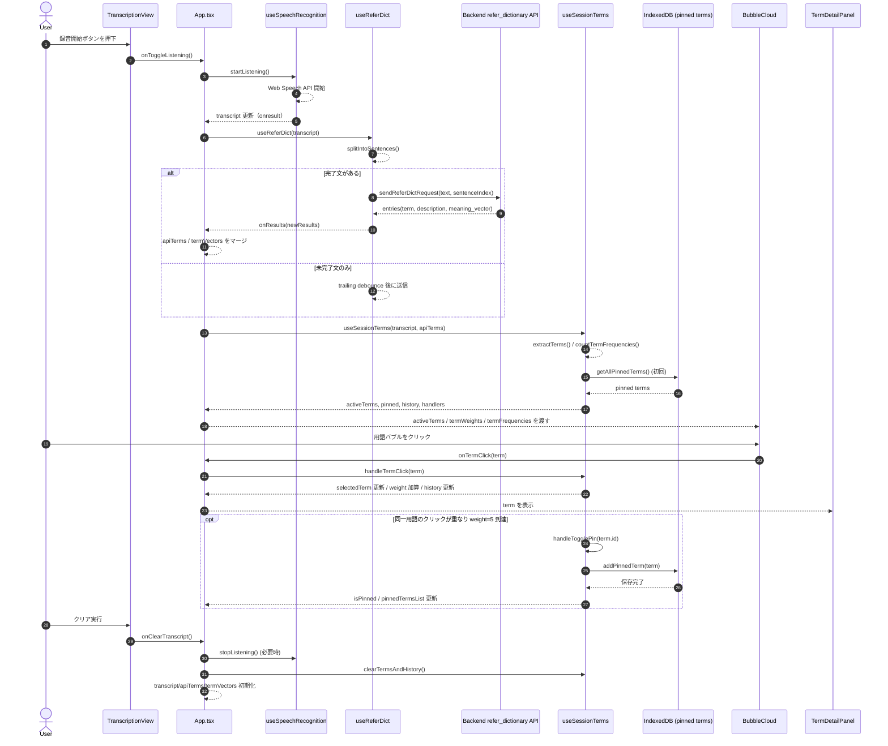

# Frontend Sequence Diagram

このドキュメントは `Frontend/src/App.tsx` を中心とした、現在の主要な実行シーケンスを示します。

```mermaid
sequenceDiagram
    autonumber
    actor User as User
    participant TV as TranscriptionView
    participant App as App.tsx
    participant SR as useSpeechRecognition
    participant RD as useReferDict
    participant API as Backend refer_dictionary API
    participant ST as useSessionTerms
    participant DB as IndexedDB (pinned terms)
    participant BC as BubbleCloud
    participant TD as TermDetailPanel

    User->>TV: 録音開始ボタンを押下
    TV->>App: onToggleListening()
    App->>SR: startListening()
    SR-->>SR: Web Speech API 開始
    SR-->>App: transcript 更新（onresult）

    App->>RD: useReferDict(transcript)
    RD-->>RD: splitIntoSentences()
    alt 完了文がある
        RD->>API: sendReferDictRequest(text, sentenceIndex)
        API-->>RD: entries(term, description, meaning_vector)
        RD-->>App: onResults(newResults)
        App-->>App: apiTerms / termVectors をマージ
    else 未完了文のみ
        RD-->>RD: trailing debounce 後に送信
    end

    App->>ST: useSessionTerms(transcript, apiTerms)
    ST-->>ST: extractTerms() / countTermFrequencies()
    ST->>DB: getAllPinnedTerms() (初回)
    DB-->>ST: pinned terms
    ST-->>App: activeTerms, pinned, history, handlers

    App-->>BC: activeTerms / termWeights / termFrequencies を渡す
    User->>BC: 用語バブルをクリック
    BC->>App: onTermClick(term)
    App->>ST: handleTermClick(term)
    ST-->>App: selectedTerm 更新 / weight 加算 / history 更新
    App-->>TD: term を表示

    opt 同一用語のクリックが重なり weight=5 到達
        ST->>ST: handleTogglePin(term.id)
        ST->>DB: addPinnedTerm(term)
        DB-->>ST: 保存完了
        ST-->>App: isPinned / pinnedTermsList 更新
    end

    User->>TV: クリア実行
    TV->>App: onClearTranscript()
    App->>SR: stopListening() (必要時)
    App->>ST: clearTermsAndHistory()
    App-->>App: transcript/apiTerms/termVectors 初期化
```

